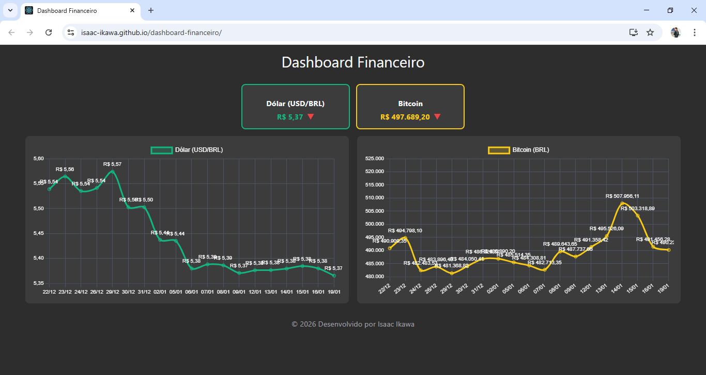

# Dashboard Financeiro | Isaac Ikawa

## 🧩 Descrição
Dashboard financeiro desenvolvido em **React + SASS**, exibindo dados **reais de Dólar (USD/BRL) e Bitcoin (BRL)**, com gráficos históricos, cards de alta/queda e layout responsivo.  

---

## 🎯 Objetivo
Demonstra conhecimentos em **React, SASS, gráficos interativos e consumo de APIs públicas**, com foco em responsividade, experiência do usuário e atualização automática de dados financeiros.  

---

## 🛠️ Tecnologias Utilizadas
- React
- SASS
- Chart.js + react-chartjs-2 (gráficos de linha)
- APIs públicas: Banco Central (Dólar) e CoinGecko (Bitcoin)

---

## ⚙️ Funcionalidades
- Layout responsivo com fundo cinza escuro  
- Cards mostrando **valores atuais e setas de alta/queda**  
- Gráficos de linha para histórico de preços  
- Atualização automática a cada minuto  

---

## 📂 Estrutura do Projeto
- **public/**: arquivos públicos (HTML, favicon, etc.)  
- **src/**: componentes React, gráficos, cards e SASS  
- **package.json**: dependências e scripts  
- **README.md**: documentação do projeto  
- **.gitignore**: arquivos ignorados pelo Git  

---

## 📱 Responsividade
O dashboard se adapta a diferentes tamanhos de tela (desktop, tablet e mobile), garantindo boa experiência de visualização sem precisar de scroll horizontal.  

---

## 🚀 Acesso ao Projeto
🔗 **Deploy:** [https://isaac-ikawa.github.io/dashboard-financeiro/](https://isaac-ikawa.github.io/dashboard-financeiro/)  
📁 **Repositório:** [https://github.com/isaac-ikawa/dashboard-financeiro](https://github.com/isaac-ikawa/dashboard-financeiro)  

---

Desenvolvido por **Isaac Ikawa** 👨‍💻
